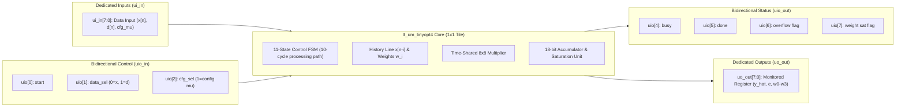

   

# `tt_um_tinyopt4` — 4-Tap Adaptive LMS FIR Engine ASIC

`tt_um_tinyopt4` is a custom digital application-specific integrated circuit (ASIC) designed for real-time system identification and adaptive filtering. Fabricated using the open-source **IHP SG13G2** (130 nm BiCMOS) process technology on the **Tiny Tapeout (TTIHP26b)** shuttle, this core implements a sequential **Least Mean Squares (LMS)** parameter update engine for a 4-tap Finite Impulse Response (FIR) filter.

The microarchitecture achieves a complete adaptive filter within a minimal silicon footprint of **$1 \times 1$ standard tile** ($\approx 167\,\mu\text{m} \times 108\,\mu\text{m}$) by combining time-multiplexed hardware sharing, power-of-two learning-rate scaling, and bounded fixed-point arithmetic.

---

## 1. Project Motivation and Problem Statement

Real-time adaptive system identification tasks—such as linear channel estimation, echo path modeling, and disturbance modeling—traditionally run on digital signal processors (DSPs) or FPGA platforms. In resource-constrained silicon platforms like Tiny Tapeout, implementing standard parallel DSP architectures presents significant hurdles:

* A parallel 4-tap FIR filter with an LMS engine typically requires at least **8 separate multipliers** (4 for the transversal convolution, 4 for the gradient update rule).
* Wide accumulators and unconstrained learning rates demand complex floating-point or wide fixed-point units, triggering metal routing congestion and design rule check (DRC) violations in dense layouts.

### Proposed Solution

`tt_um_tinyopt4` addresses these constraints through structural resource sharing:

* **Single-Multiplier Datapath:** A single $8 \times 8$-bit signed multiplier handles both forward filtering and backward weight adaptation across consecutive clock cycles.
* **Power-of-Two Scaling:** The LMS convergence rate ($\mu$) is constrained to negative powers of two ($\mu = 2^{-s}$), converting a multi-bit multiplier into a lightweight arithmetic right-shifter.
* **Bounded Arithmetic:** An 18-bit internal accumulator with explicit saturation logic protects the datapath against sign-inversion overflows during burst transients.

---

## 2. Top-Level System Architecture and Pinout

`tt_um_tinyopt4` interfaces directly with the standard Tiny Tapeout synchronous 8-bit bus architecture:



### Pin Description

| Pin | Name | Direction | Description |
| --- | --- | --- | --- |
| `ui_in[7:0]` | `data_in` | Input | Input sample $x[n]$, desired reference $d[n]$, or shift configuration $s$ |
| `uo_out[7:0]` | `data_out` | Output | Multiplexed diagnostic output ($y[n]$, $e[n]$, $w_0, w_1, w_2, w_3$) |
| `uio_in[0]` | `start` | Input | Operation trigger strobe |
| `uio_in[1]` | `data_sel` | Input | Input routing selector: `0` = sample $x[n]$, `1` = reference $d[n]$ |
| `uio_in[2]` | `cfg_sel` | Input | Configuration mode: writes $s$ to the learning rate shift register |
| `uio_in[3]` | `unused` | Input | Reserved (ignored internally) |
| `uio_out[4]` | `busy` | Output | High while the FSM is processing an iteration |
| `uio_out[5]` | `done` | Output | Single-cycle pulse marking the end of weight updates |
| `uio_out[6]` | `overflow` | Output | Status flag: accumulator or error calculation overflow |
| `uio_out[7]` | `w_sat` | Output | Status flag: weight coefficient register saturated |

---

## 3. Mathematical Foundations and Algorithm

The internal core operates strictly in signed fixed-point **$Q1.7$** format (1 sign bit, 7 fractional bits). Numerical values map to the dynamic range $[-1.0, +0.9921875]$ via signed 8-bit two's complement integers $[-128, +127]$.

`tt_um_tinyopt4` is dedicated specifically to the parameter identification/adaptation engine of an adaptive FIR filter; it is not a closed-loop plant controller.

### 1. FIR Transversal Output

The predicted output $\hat{y}[n]$ is computed by the inner product of the weight vector and the input delay line:

$$\hat{y}[n] = \sum_{i=0}^{3} w_i[n] \cdot x[n-i]$$

### 2. Error Evaluation

The estimation error $e[n]$ is derived by subtracting the estimated response from the external target reference $d[n]$:

$$e[n] = \text{sat}_{Q1.7}\Big(d[n] - \hat{y}[n]\Big)$$

Where $\text{sat}_{Q1.7}(v)$ clamps values exceeding $[-128, +127]$ to prevent modular wrap-around.

### 3. Gradient Parameter Adaptation

The standard LMS gradient descent update rule:

$$w_i[n+1] = w_i[n] + \mu \cdot e[n] \cdot x[n-i], \quad i \in \{0, 1, 2, 3\}$$

By restricting $\mu = 2^{-s}$ (where $s \in [0, 7]$), the update term avoids generic multiplication:

$$\Delta w_i = \Big(e[n] \cdot x[n-i]\Big) \gg (7 + s)$$

$$w_i[n+1] = \text{sat}_{Q1.7}\Big(w_i[n] + \Delta w_i\Big)$$

---

## 4. Operation Flow and Finite State Machine (FSM)

An iteration requires **10 clock cycles** from initial sample intake to coefficient write-back:

```mermaid
stateDiagram-v2
    [*] --> S_IDLE
    S_IDLE --> S_IDLE: start=1 & data_sel=0 (shift x[n] into buffer)
    S_IDLE --> S_MAC0: start=1 & data_sel=1 (latch d[n])

    state "Forward Filter Phase" as Fwd {
        S_MAC0 --> S_MAC1: acc = w0 * x0
        S_MAC1 --> S_MAC2: acc += w1 * x1
        S_MAC2 --> S_MAC3: acc += w2 * x2
        S_MAC3 --> S_ERR:  acc += w3 * x3
    }

    state "Error Calculation" as Err {
        S_ERR --> S_UPD0: y_hat = sat(acc >>> 7); e = sat(d - y_hat)
    }

    state "LMS Adaptation Phase" as Adapt {
        S_UPD0 --> S_UPD1: w0 += (e * x0) >>> (7+s)
        S_UPD1 --> S_UPD2: w1 += (e * x1) >>> (7+s)
        S_UPD2 --> S_UPD3: w2 += (e * x2) >>> (7+s)
        S_UPD3 --> S_DONE: w3 += (e * x3) >>> (7+s)
    }

    S_DONE --> S_IDLE: Assert done, deassert busy

```

### Complete Execution Cycle Breakdown

* **Cycle 0 (`S_IDLE`):** System waits for assertion of `start`. When loading $x[n]$, the shift register advances in 1 cycle. When loading $d[n]$, execution branches to `S_MAC0`.
* **Cycles 1–4 (`S_MAC0` to `S_MAC3`):** The shared multiplier processes $w_i[n] \cdot x[n-i]$ in consecutive cycles. The 18-bit accumulator accumulates the scaled products.
* **Cycle 5 (`S_ERR`):** Output $\hat{y}[n]$ is scaled from the accumulator and saturated to $Q1.7$. The scalar error $e[n] = d[n] - \hat{y}[n]$ is computed and latched.
* **Cycles 6–9 (`S_UPD0` to `S_UPD3`):** The multiplier inputs switch to $e[n]$ and $x[n-i]$. The 16-bit signed product is shifted by $(7 + s)$, added to $w_i[n]$, checked for saturation, and written back to register $w_i$.
* **Cycle 10 (`S_DONE`):** `busy` is dropped, `done` pulses high for 1 clock cycle, and internal state returns to `S_IDLE`.

---

## 5. Hardware Architecture and Resource-Reduction Techniques

To fit the complete datapath inside a single **$1 \times 1$ tile** without placement or routing congestion on IHP SG13G2 standard cells, the following structural decisions were implemented:

1. **Shared Multiplier Hardware:** Instead of instantiating 8 distinct multiplier blocks, multiplexers dynamically route operands $(w_i, x_{n-i})$ or $(e, x_{n-i})$ into one shared $8 \times 8$-bit two's complement multiplier.
2. **Barrel Shifter vs. Dedicated Hardware Multiplier:** Using $\mu = 2^{-s}$ replaces an entire 16-bit multiplier stage with a configurable arithmetic right-shifter, conserving silicon area.
3. **Register Reuse for Diagnostics:** Diagnostic and observation pins reuse the core input bus. Setting `uio_in = 0` and driving `ui_in[2:0]` allows inspection of any internal register through `uo_out[7:0]` without inserting an intrusive scan chain:
* `3'b000`: Output estimation ($\hat{y}[n]$)
* `3'b001`: Estimation error ($e[n]$)
* `3'b010` to `3'b101`: Weights $w_0$ through $w_3$


4. **Saturation Logic Over Wide Buses:** Truncation without saturation can trigger sign inversion and catastrophic divergence during LMS adaptation. Compact saturation logic maintains numerical stability without requiring datapath widths beyond 18 bits.

---

## 6. Verification Methodology and Deployment Readiness

The readiness of `tt_um_tinyopt4` has been validated across four verification layers:

```
[Algorithmic Model] ──> [RTL Simulation] ──> [Gate-Level Sim] ──> [Physical Hardening]
    Python Q1.7            Cocotb / Icarus       GL Netlist + SDF      LibreLane

```

* **RTL Functional Verification:** Written with `cocotb` and simulated in `iverilog`. Two tests are executed: a single-iteration smoke test that verifies the FSM `busy`/`done` handshake and the `S_DONE` pulse timing, and a 1500-sample closed-loop convergence test that drives the engine against a target plant $W^* = [64, -32, 16, -8]$ and checks that all four weight registers settle within $|w_i - W^*_i| \le 10$ LSB.
* **Closed-Loop Adaptive Convergence:** A 1500-sample test bench simulates an unknown transversal plant ($W^* = [64, -32, 16, -8]$ in $Q1.7$). The hardware weights converge to the target vector within expected $Q1.7$ quantization noise limits ($\vert{}w_i - W^*_i\vert{} \le 10\text{ LSB}$).
* **Gate-Level Simulation (GLS):** The synthesized gate-level netlist was simulated under timing annotations using cell models from `ihp-sg13g2`, passing identical convergence test sets.
* **Physical Implementation & Verification:** Executed via the LibreLane automated ASIC flow:
* **Area:** Successfully packed and placed inside a **$1 \times 1$ tile** ($\approx 1,900$ cells).
* **DRC / LVS:** Clean check with 0 design rule and layout-versus-schematic violations via KLayout and Magic.
* **Timing (STA):** Setup and hold slack targets met at nominal 10 MHz clock constraints.


---

## 7. Limitations and Future Improvements

* **Filter Order:** The transverse line is fixed at 4 taps. Expanding tap capacity would require moving from flip-flop storage to a dual-port SRAM block or an off-chip memory controller.
* **Dynamic Range Floor:** The $Q1.7$ fixed-point format exhibits a steady-state residual error floor of approximately $\pm 4$ to $\pm 8$ LSB due to truncation and the finite LMS step size.
* **Throughput:** Processing each sample requires 10 clock cycles. Operating at 10 MHz yields a maximum continuous throughput of $1.0\text{ MSamples/s}$.

---

## 8. Repository Structure

```text
├── docs/
│   └── info.md             # Project documentation for the Tiny Tapeout website
├── src/
│   ├── config.json         # LibreLane hardening settings for IHP SG13G2
│   └── project.v           # Verilog-2001 RTL implementation of tt_um_tinyopt4
├── test/
│   ├── Makefile            # Simulation build script for Cocotb
│   ├── tb.v                # Verilog testbench wrapper connecting DUT
│   └── test.py             # Cocotb convergence verification tests
├── info.yaml               # Shuttle metadata, pinout mapping, and tile definitions
└── LICENSE                 # Open-source license terms

```

---

## 9. Simulation and Reproduction Guide

### Prerequisites

* Python 3.8+
* Icarus Verilog (`iverilog`)
* Cocotb framework:
```bash
pip install cocotb pytest

```


### Running RTL Simulation Locally

1. Clone the repository:
```bash
git clone https://github.com/tiberthyn/tt-tinyopt4.git
cd tt-tinyopt4

```


2. Run the test suite:
```bash
cd test
make clean
make

```


3. A successful verification output terminates with:
```text
** TESTS=2 PASS=2 FAIL=0 SKIP=0 **

```


---

## 10. Project Status

| Milestone | Status | Details |
| --- | --- | --- |
| **Architectural Definition** | Complete | Fixed-point model and mathematical bounds finalized |
| **RTL Implementation** | Complete | Verilog-2001 behavioral description (`src/project.v`) |
| **Cocotb Verification** | Complete | 1500-sample identification convergence test passing |
| **Physical Hardening** | Complete | Hardened to **$1 \times 1$ tile** with LibreLane on IHP SG13G2 |
| **DRC / LVS / Precheck** | Passing ($\checkmark$) | Zero violations detected by standard verification tools |
| **Gate-Level Simulation** | Passing ($\checkmark$) | Zero timing or functional regression on gate netlist |
| **CI / Automation** | Passing ($\checkmark$) | GitHub Actions `docs`, `test`, `gds`, and `viewer` workflows operational |
| **Fabrication Readiness** | Ready | Prepared for tapeout submission on Shuttle TTIHP26b |
